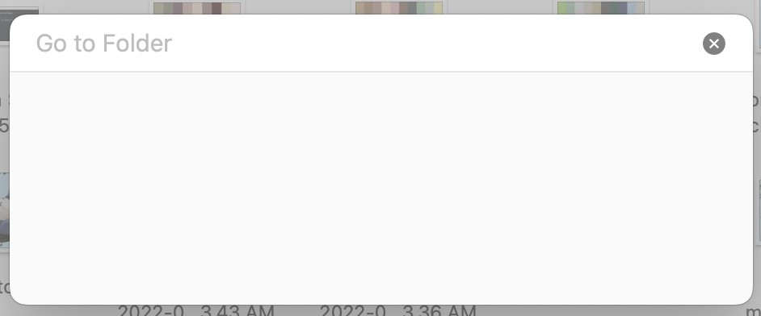
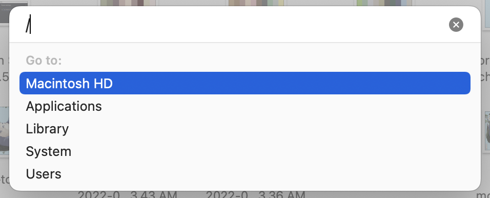
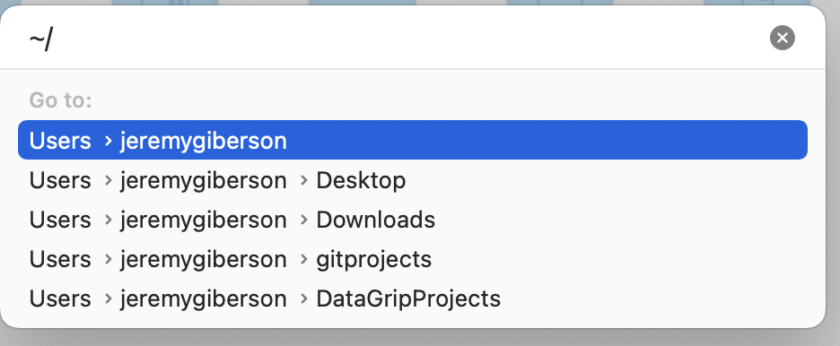
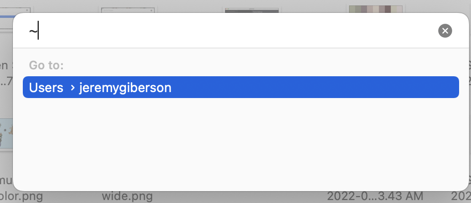

# Directory Selector
For security purposes, we'll narrow auto-complete to user's home directory.
We'll allow user to provide exact paths outside of their home directory, but no autocomplete from there.

Modeled after go to directory in OSX.

Notes, up/down to select auto complete results.
Use right arrow to complete.
Use [enter] to accept. 

